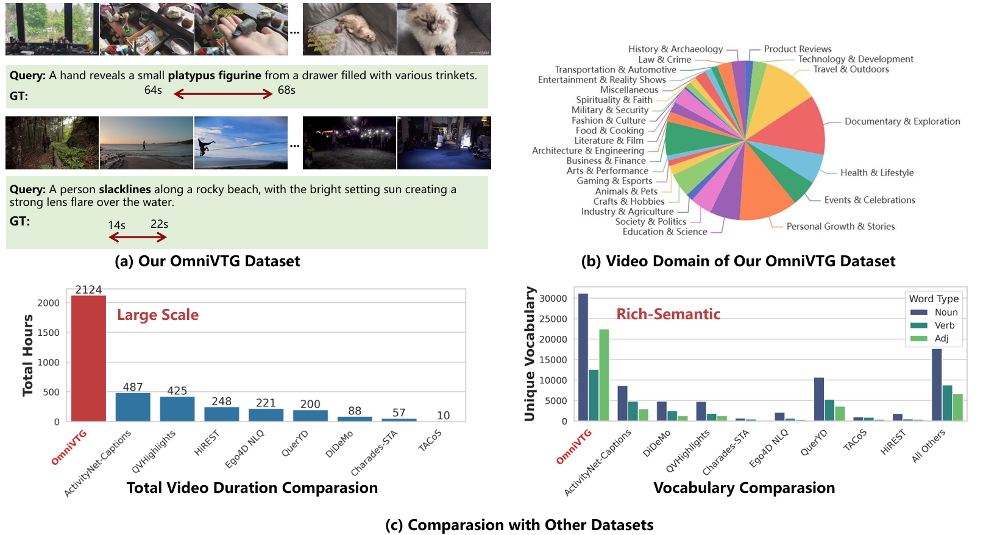

# OmniVTG
OmniVTG: A Large-Scale Dataset and Training Paradigm for Open-World Video Temporal Grounding

**Code is coming soon.**

## Abstract

Video Temporal Grounding (VTG), the task of localizing video segments from natural language queries, faces significant challenges in open-world applications. These challenges stem from the limited scale and semantic diversity of existing datasets, which lead to a performance gap between common and rare concepts. To overcome these limitations, we introduce OmniVTG, a new large-scale dataset for open-world VTG, coupled with a Self-Correction Chain-of-Thought (CoT) training paradigm designed to enhance the grounding capabilities of Multimodal Large Language Models (MLLMs). Our OmniVTG is constructed via a novel Semantic Coverage Iterative Expansion pipeline, which first identifies gaps in the vocabulary of existing datasets and collects videos that are highly likely to contain these target concepts. For high-quality annotation, we leverage the insight that modern MLLMs excel at dense captioning more than direct grounding and design a caption-centric data engine to prompt MLLMs to generate dense, timestamped descriptions. Beyond the dataset, we observe that simple supervised finetuning (SFT) is insufficient, as a performance gap between rare and common concepts still persists. We find that MLLMs' video understanding ability significantly surpasses their direct grounding ability. Based on this, we propose a Self-Correction Chain-of-Thought (CoT) training paradigm. We train the MLLM to first predict, then use its understanding capabilities to reflect on and refine its own predictions. This capability is instilled via a three-stage pipeline of SFT, CoT finetuning, and reinforcement learning. Extensive experiments show our approach not only excels at open-world grounding in our OmniVTG dataset but also achieves state-of-the-art zero-shot performance on four existing VTG benchmarks.

